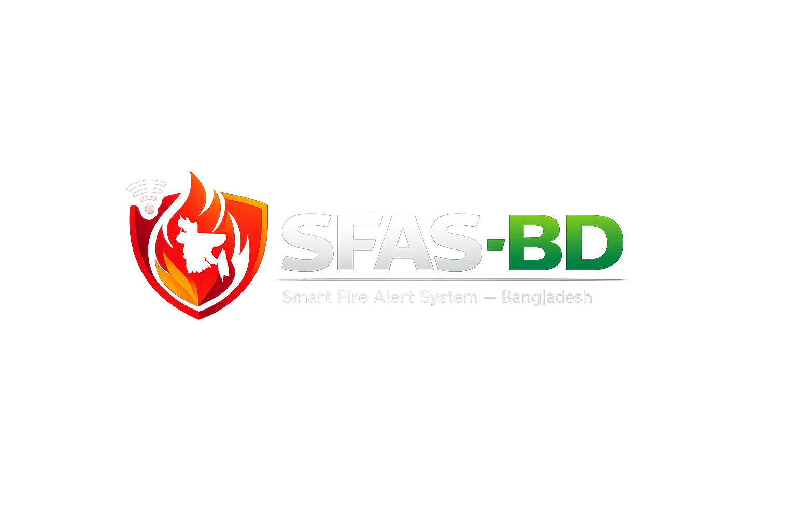

<p align="center">
  
</p>

<h1 align="center">SFAS-BD — Smart Fire Alert System, Bangladesh</h1>

<p align="center">
  Control-room console for <b>OGNIBORMO</b>, a multi-sensor smart fire detection<br/>
  and monitoring system by <b>Team HALCYON</b>, Armed Police Battalion School and College.
</p>

<p align="center">
  
  
  
  
  
  
  
  
  
</p>

---

**One console per fire station.** A station — Uttara, say — is given this system
to monitor every building in its area that has OGNIBORMO units installed. The
console is scoped to that station: its buildings, its units, its incidents. An
Uttara operator never sees Gazipur's alerts. The active station is set in
**Settings**, and every screen, query and live socket room follows it.

An OGNIBORMO unit watches five environmental parameters at once — flame, smoke,
gas, temperature and humidity — and this system turns that stream into something
an operator can act on: **Detect → Monitor → Analyze → Alert → Respond**.

> **Scope note.** The field unit currently deployed is an **Arduino prototype**
> connected over serial. The `firmware/` folder holds ESP32 sketches for the
> planned upgrade (wireless, PLC-driven) path — code that exists, not hardware
> that is shipped. The HTTP ingest endpoint already accepts a networked unit so
> that upgrade drops in without changing the pipeline.

## Contents

- [Why multi-sensor fusion](#why-multi-sensor-fusion)
- [Features](#features)
- [Tech stack](#tech-stack)
- [Getting started](#getting-started)
- [No Arduino attached?](#no-arduino-attached)
- [Deploying](#deploying)
- [API](#api)
- [Project structure](#project-structure)
- [Security note](#security-note)
- [Theming](#theming)
- [License](#license)

---

## Why multi-sensor fusion

A single sensor tripping is not a fire. High temperature alone is a hot
afternoon; smoke alone is a cooking pan. Confidence comes from **independent
sensors agreeing at once**.

[`backend/src/modules/sensors/riskEngine.ts`](backend/src/modules/sensors/riskEngine.ts)
scores every reading 0–100 and records which sensors contributed, so the
dashboard can explain *why* an alert fired rather than just showing a number:

| Scenario | Readings | Score | Result |
|---|---|---|---|
| Quiet room | 30 °C, 58 %, smoke 25, gas 90 | **0** | no alert |
| Hot day only | 55 °C, smoke 20, gas 80 | **4** | no alert |
| Cooking smoke | 34 °C, smoke 110, gas 120 | **13** | no alert |
| Smouldering | 54 °C, 28 %, smoke 150, gas 180 | **44** | Important |
| LPG leak | 31 °C, gas 520 | **45** | Important |
| Flame, nothing else | flame only | **60** | Important |
| Flame + smoke | flame, smoke 130 | **82** | **Critical** |
| Full fire signature | flame, smoke 240, gas 410, 78 °C | **100** | **Critical** |

The interesting rows are *cooking smoke* (stays quiet — this is the false-alarm
case the project exists to avoid) and *flame alone* vs *flame + smoke*: a lone IR
flame sensor can trip on sunlight, so it escalates to Critical only once a second
sensor agrees.

Thresholds are configurable — `SMOKE_THRESHOLD`, `GAS_THRESHOLD`,
`TEMP_THRESHOLD` in `backend/.env`.

---

## Features

- 🗺️ **Live map** (`/`) — alerts geolocated across Dhaka on a dark OpenStreetMap basemap, with a live-updating sidebar
- 📊 **Dashboard** (`/dashboard`) — Overview, Live Sensors, Devices/Buildings/Stations CRUD, Units & Crew, and a reporting Summary tab
- 🔔 **Alert console** (`/notifications`) — filter, bulk acknowledge/read/delete, full alert detail with the fusion breakdown and operator log
- 🚒 **Dispatch** — ETA-ranked unit recommendations, one-click dispatch, and a assigned → rolling → on scene → cleared lifecycle
- 🛣️ **Routing & ETA** — Dhaka-traffic-aware estimate out of the box, or real road routes via an OSRM instance
- 🚨 **Full-screen critical alerts** — takes over the screen for a live or recent Critical, re-sounds until acknowledged
- ⚡ **Low-latency ingest** — alert raised and broadcast before secondary writes are awaited (~38 ms median round trip, measured locally)
- 📱 **Responsive** — full mobile layout: bottom-sheet alert list, drawer nav, bottom-sheet critical banner
- 🌓 **Light / dark / system theming** via a single CSS-variable ramp, no `dark:` class sprawl
- 🧪 **Built-in device simulator** — four synthetic OGNIBORMO units run through the *real* ingest pipeline when no hardware is attached, for demos and hosted deployments

<details>
<summary><b>More detail on each area</b></summary>

### Units, crew and dispatch

The dashboard's **Units & Crew** tab is the station officer's unit board: which
appliances are resting at station, which are en route or on scene, and which are
out of service. Each unit expands to its full crew roster — rank, role, phone,
blood group, certifications, years of service — and any crew member can be
flipped on or off duty inline.

From an incident, the **Dispatch** panel lists every available unit *ranked by
arrival time*, pre-selects a sensible first alarm for the incident type (an
engine always; medic and rescue for a critical; a ladder above the 4th floor;
foam for a gas incident), and assigns them in one click. Dispatching also
acknowledges the incident, because that is what it means.

Each dispatch then moves through **assigned → rolling → on scene → cleared**,
and those timestamps feed the response-time reporting.

### Routing and ETA

[`backend/src/lib/routing.ts`](backend/src/lib/routing.ts) estimates how long
each unit will take to reach the incident. Units are ordered by **ETA, not
distance** — a unit 3 km away across a rush-hour arterial can lose to one 5 km
away on clear roads.

Without a routing provider it multiplies straight-line distance by a road
circuity factor (1.4 for Uttara's street grid) and divides by a speed that
varies with the hour, because Dhaka traffic is the dominant term in any real
response time: 14 km/h in the morning rush, 12 in the evening, 34 overnight,
plus 1.5 minutes turnout. Every figure is labelled as an estimate in the UI.

Set `ROUTING_OSRM_URL` to an OSRM instance and it uses real road routes instead,
including the polyline.

### Reporting

The **Summary** tab answers the questions a station officer actually asks:

- **Where** — alerts by sector, and the buildings raising most of them (candidates for an inspection visit)
- **What** — by incident type, with the share of each
- **Why** — which sensors contributed, so a dominant cause is visible at source
- **When** — alerts by hour of day, a staffing signal
- **How fast** — average time to acknowledge and resolve, and actual travel time measured against the estimated ETA

### Critical alerts

A corner toast is the wrong weight for a building fire. A critical alert takes
over the screen with the location, risk score, people at risk, flame state and
which sensors agreed — with **Acknowledge** as the primary action. It re-sounds
every 12 seconds until acknowledged, and `Esc` snoozes without acknowledging.

Only *current* alerts take over: one that arrived over the socket while the
console was open, or was raised in the last 10 minutes. Opening the console to a
backlog of old unacknowledged criticals shows the list, not a wall of takeovers.

Everything is configurable in Settings — full-screen takeover, sound, repeat,
desktop notifications, and the minimum priority that interrupts you.

### Speed

The ingest path is ordered for latency: the risk score is computed and the alert
is raised and broadcast **before** the reading-history and device-snapshot writes
are awaited. In practice the socket push reaches the browser before the ingest
HTTP call returns — measured at a **38 ms median** round trip locally, with
socket round-trip time shown live in Settings.

WebSocket is preferred on first connect (no long-poll handshake) and payload
compression is off: alert payloads are ~1KB, and compressing them costs more
latency than the bytes are worth.

</details>

---

## Tech stack

| Layer | Stack |
|---|---|
| **Frontend** | Next.js 16 (App Router) · React 19 · TypeScript · Redux Toolkit · Tailwind CSS 4 · Radix UI · Leaflet / react-leaflet · Socket.IO client |
| **Backend** | Node.js 20+ · Express 4 · TypeScript (ESM/NodeNext) · Socket.IO · Zod · Winston · bcrypt |
| **Database** | MongoDB (Atlas or local) via Mongoose |
| **Cache / rate limiting** | Redis (optional — falls back to in-memory) |
| **Hardware** | Arduino prototype (serial) today · ESP32 firmware in `firmware/` for the wireless upgrade |
| **Hosting** | Vercel (frontend) · Render (API, long-lived process for Socket.IO + simulator) · MongoDB Atlas |

---

## Getting started

**Prerequisites:** Node 20+, MongoDB. Redis is optional — without it, caching is
skipped and rate limiting falls back to per-process memory.

```bash
cd backend && npm install && cp .env.example .env
```

Set `MONGO_URI` in `backend/.env` (a local `mongodb://127.0.0.1:27017` or an
Atlas connection string both work), then:

```bash
npm run seed && npm run dev
```

`npm run seed:units` adds response units and their crews on top of that.

Upgrading an existing database? `npm run backfill:station -- UTT-02` assigns a
station to alerts created before the console became station-scoped (inferring
from each alert's device, then its building, then the fallback code given).

```bash
cd frontend && npm install && cp .env.example .env.local && npm run dev
```

Frontend on http://localhost:3000, API on http://localhost:8080.

### No Arduino attached?

Set `DEVICE_SIMULATOR=true` (and `SERIAL_ENABLED=false`) in `backend/.env`
and the API runs four synthetic OGNIBORMO units itself, inside the server
process, through the real ingest pipeline. Each unit is a small state machine
with its own room baseline: mostly quiet, with the occasional cooking-smoke
false alarm that correctly does *not* alert, smoulders that sometimes escalate
to flame, gas leaks, and fires — every one scored by the fusion engine and
pushed over the socket like a real frame. This is what the hosted demo runs;
the Settings page shows which units are simulated and what each is doing.

For a one-off from a separate terminal there is also the older script:

```bash
cd backend && npm run simulate
```

`npm run simulate -- --burst` fires one round of incidents and exits.

### Deploying

Frontend on Vercel, API on Render, database on MongoDB Atlas — all free
tiers. [DEPLOYMENT.md](DEPLOYMENT.md) walks through it and lists every URL
and variable that has to be exchanged between the three. `render.yaml`,
`frontend/vercel.json` and `backend/vercel.json` ship ready to use.

> The backend also has a Vercel-compatible serverless entry
> ([`backend/api/index.ts`](backend/api/index.ts)) for REST-only access to the
> database. Socket.IO and the device simulator need one persistent process, so
> they don't run there — Render remains the host for the full real-time console.

---

## API

Base: `/api/v1`

| Resource | Endpoints |
|---|---|
| Alerts | `GET /alerts` (paged, filtered, searchable) · `GET /alerts/:id` · `GET /alerts/:id/related` · `GET /alerts/stats` · `GET /alerts/timeseries?hours=` · `GET /alerts/top-devices` — all accept `?stationId=` |
| Alert workflow | `PATCH /alerts/:id/read` · `/acknowledge` · `/resolve` · `/reopen` · `POST /alerts/:id/comments` · `DELETE /alerts/:id` |
| Bulk | `PATCH /alerts/bulk/read` · `/bulk/acknowledge` · `POST /alerts/bulk/delete` |
| Devices | full CRUD · `GET /devices/stats` · `/telemetry` · `/readings` · `GET /devices/:code/readings` · `POST /devices/heartbeat` |
| Buildings / Stations | full CRUD · `GET /buildings/stats` |
| Units | full CRUD · `GET /units/stats` · `PATCH /units/:id/status` · crew add/update/remove |
| Dispatch | `GET /alerts/:id/units/recommend` · `POST /alerts/:id/dispatch` · `GET /alerts/:id/dispatches` · `GET /units/dispatches/active` · `PATCH /units/dispatches/:id/status` |
| Analytics | `GET /analytics/summary` · `/areas` · `/causes` · `/response` |
| Sensors | `POST /sensors/readings` (HTTP ingest) · `POST /sensors/evaluate` (score without storing) · `GET /sensors/serial-status` |
| Health | `GET /health/live` · `/ready` · `/metrics` |

Real-time over Socket.IO: `alert:new`, `alert:update`, `alert:delete`,
`telemetry:reading`, `unit:update`, `dispatch:new`, `dispatch:update`. A console
emits `station:join` with its station id and is then served only that station's
traffic.

---

## Project structure

```text
backend/src
├── config/        env, cors, redis, socket, serial, rate limiting
├── db/models/     Alert, Device, Building, Station, Reading, Unit, Dispatch
├── modules/
│   ├── alerts/    controller · service · repository · validator
│   ├── devices/   + telemetry history and API-key issuance
│   ├── buildings/ · stations/
│   ├── units/     unit board, crew roster, dispatch lifecycle
│   ├── analytics/ area / type / cause / hour / response reporting
│   └── sensors/   riskEngine · ingest service · serial listener · simulator
├── lib/routing.ts ETA + route estimation
├── routes/ · middlewares/ · scripts/ (seed, seed-units, simulate, export/import data)
└── api/index.ts   Vercel serverless entry (REST only)

frontend/src
├── app/           map · dashboard · notifications
├── api/           typed client
├── components/    home · dashboard (+ charts) · notification(s) · navbar
│                  profile · settings · alerts · ui
├── redux/         alert + telemetry + session slices
└── socket/        Socket.IO client

firmware/          ESP32 sketches for the planned wireless upgrade
```

---

## Security note

**There is no authentication.** `/sign-in` is a placeholder. Add route
protection and API token verification before exposing this anywhere public.

Device API keys are issued once at creation and stored only as bcrypt hashes —
they cannot be retrieved again.

---

## Theming

Light, dark and system, via `next-themes` with a class on `<html>`.

The console was authored dark-first and uses the slate ramp consistently — 950
is the deepest surface, 900/800 are raised panels and hairlines, 300→50 climb
from body text to headings. Light mode therefore **inverts that ramp** in
`globals.css` rather than adding a `dark:` variant to ~840 utility classes
across 41 files. Tailwind v4 compiles `bg-slate-900` to
`var(--color-slate-900)`, so redefining those variables under `.light` re-skins
every surface at once with no component churn and nothing to keep in sync.

Status hues — red, amber, emerald, sky, orange — are deliberately not remapped: a
critical alert stays red in both themes.

---

## License

[MIT](LICENSE) © 2026 Tahsin Hassan

---

<p align="center"><sub>Built by <b>Team HALCYON</b> — Armed Police Battalion School and College.</sub></p>
